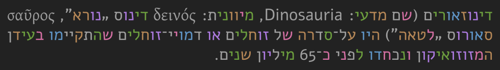
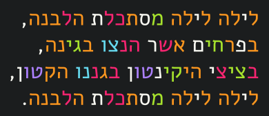

# vocolourisation #

LaTeX template for colourising [abjad](http://en.wikipedia.org/wiki/Abjad) (mainly [Hebrew](http://en.wikipedia.org/wiki/Hebrew_alphabet) and [Arabic](http://en.wikipedia.org/wiki/Arabic_alphabet)) vocalisation (vocalisation + colourisation = *vocolourisation*).

It allows colourising each letter with one colour from a colour scheme ([Molokai](https://github.com/tomasr/molokai), [Solarized](https://github.com/altercation/solarized) and [Invisibone](https://github.com/baskerville/invisibone)). It is quite simple and straight forward, and allows one to control the saturation easily.

## Why is it needed? ##

Abjad alphabets provide only a partial information about how to read a written text. For example, consider the first line of `jakinton.tex`: לילה־לילה מסתכלת הלבנה. It can be [transliterated](http://en.wikipedia.org/wiki/Transliteration) as *ljlh-ljlh mstklt hlbnh*, recording mostly the consonants, but in [transcription](http://en.wikipedia.org/wiki/Transcription) it is *lájla-lájla mistakélet ha levana*. When one reads a Hebrew or Arabic text without vocalic diacritics ([nikud](http://en.wikipedia.org/wiki/Niqqud) or [ḥarakāt](http://en.wikipedia.org/wiki/Harakat)), which is the most common case, xe has to constantly fill in the vowels (דרך *drk*, for example, can mean either *darax* ‘he stepped on’ or *dérex* ‘a way’). When learning to read, either when learning the language as a second language or when a child learns to read in xyr own language, this makes the process difficult.

This is where `vocolourisation` comes in: it provides a midway between vocalisation diacritics (which in the case of Hebrew are extremely anachronistic) and a regular text&nbsp;— each vowel has a special colour, and one can control the saturation gradually, according to the progress of the learning progress, from fully saturated colours (easiest) to monochrome text which is identical to the normal, not coloured text (most difficult).

I made `vocolourisation` in order to help my 4½ y.o. child [Ilil](https://github.com/ilil) to learn reading.

## Texts ##

* `dinozaurim.tex` — An abbreviated version of the [article about dinosaurs](http://he.wikipedia.org/wiki/%D7%93%D7%99%D7%A0%D7%95%D7%96%D7%90%D7%95%D7%A8) in the Hebrew Wikipedia.
* `jakinton.tex` — *Pizmon la Jakinton*, a lullaby by [Lea Goldberg](http://en.wikipedia.org/wiki/Lea_Goldberg).

I may add more texts in the future, when Ilil will finish reading `dinozaurim`. You are very welcome to add new texts (especially in Arabic); fork and pull request the usual way.

## Examples ##

From `dinozaurim.tex` with Invisibone:

From `jakinton.tex` with Molokai:

